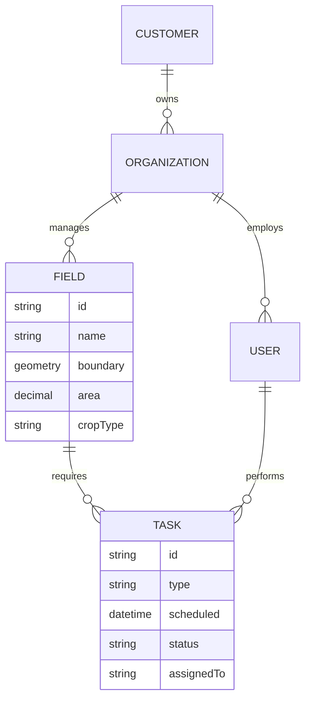
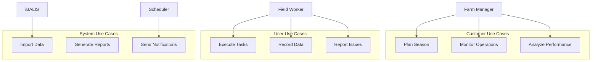

# 🔍 Analyze Domain Use Cases: $ARGUMENTS


**Analysis Directive**: Transform technical implementations into comprehensive business understanding, extracting use cases that reveal how the system delivers value to customers and their users.

## Phase 1: Domain Context Understanding


### Parse Analysis Request
I'll analyze your request to understand:
- **Domain Focus**: Specific domain or comprehensive analysis
- **Code Location**: Directory path or domain name
- **Depth Required**: Quick scan or deep dive
- **Output Format**: Executive summary or detailed catalog
- **Audience**: Technical, business, or mixed

### Domain Intelligence Framework
```yaml
Analysis Parameters:
  Domain: [Extracted from $ARGUMENTS]
  Scope: [Single domain | Multi-domain | Full system]
  Perspective: [Customer | End-user | Both]
  Detail Level: [Summary | Comprehensive | Deep dive]
  Business Focus: [Operations | Strategy | Compliance | All]
```

## Phase 2: Code Discovery & Analysis

### Intelligent Code Exploration
I'll systematically explore the codebase to understand the domain structure.

```typescript
interface DomainAnalysis {
  entities: string[];      // Core business objects
  services: string[];      // Business operations
  repositories: string[];  // Data access patterns
  controllers: string[];   // API endpoints
  events: string[];       // Domain events
  validators: string[];   // Business rules
}
```

### Multi-Pattern Search Strategy
```bash
# Entity discovery
**/*Model.cs | **/*Entity.cs | **/Models/*.cs

# Service layer
**/*Service.cs | **/*BusinessService.cs

# API endpoints  
**/Controllers/*.cs | **/*Controller.cs

# Domain events
**/*Event.cs | **/Events/*.cs

# Business rules
**/*Validator.cs | **/*Rules.cs
```

## Phase 3: Business Domain Extraction


### Deep Domain Analysis
I'll engage our Business Domain Analyst to extract comprehensive insights.

Using the Business Domain Analyst agent to: Analyze the domain/code for $ARGUMENTS:

1. **Domain Model Extraction**:
   - Identify core entities and their relationships
   - Map aggregates and bounded contexts
   - Extract value objects and domain services
   - Document invariants and constraints

2. **Use Case Discovery**:
   - Extract use cases from service methods
   - Map API endpoints to user capabilities
   - Identify actor roles from authorization
   - Document business workflows

3. **Business Rule Mining**:
   - Extract validation logic as rules
   - Identify domain invariants
   - Document compliance requirements
   - Map calculation logic

4. **Stakeholder Analysis**:
   - Identify primary actors and their goals
   - Map supporting actors (systems, time)
   - Document value propositions
   - Analyze pain points addressed

5. **Value Stream Mapping**:
   - How does this domain create value?
   - What processes does it enable?
   - What efficiencies does it provide?
   - What risks does it mitigate?

Return comprehensive domain analysis with visual models and use case catalog.

## Phase 4: Use Case Synthesis & Organization

### Use Case Categorization
```yaml
Use_Case_Taxonomy:
  By_Actor:
    Customer_Facing:
      - Strategic planning use cases
      - Operational management use cases
      - Reporting and analytics use cases
    
    End_User_Facing:
      - Daily workflow use cases
      - Data entry use cases
      - Task execution use cases
    
    System_Facing:
      - Integration use cases
      - Automation use cases
      - Maintenance use cases
  
  By_Value:
    Efficiency:
      - Time-saving use cases
      - Automation use cases
      - Optimization use cases
    
    Compliance:
      - Regulatory use cases
      - Audit use cases
      - Reporting use cases
    
    Insights:
      - Analytics use cases
      - Prediction use cases
      - Decision support use cases
```

## Phase 5: Visual Model Generation

### Domain Visualization
I'll create clear visual representations of the domain.

#### Entity Relationship Model


#### Use Case Overview


## Phase 6: Deliverable Generation

### Output Format Selection
Based on your needs, I'll generate:

#### 1. Executive Summary Format
```markdown
# [Domain Name] - Business Capability Summary

## 🎯 Value Proposition
[One paragraph explaining what this domain enables]

## 👥 Key Stakeholders
- **[Actor]**: [Primary value received]
- **[Actor]**: [Primary value received]

## 📊 Core Use Cases
1. **[Use Case]**: [Business value]
2. **[Use Case]**: [Business value]
3. **[Use Case]**: [Business value]

## 💰 Business Impact
- Efficiency: [Metric]
- Compliance: [Metric]  
- ROI: [Metric]
```

#### 2. Detailed Use Case Catalog
```markdown
# [Domain] Use Case Catalog

## UC-001: [Use Case Name]
**Actor**: [Primary actor]
**Goal**: [What they achieve]
**Trigger**: [What initiates]
**Value**: [Business benefit]

### Scenario
1. [Step 1]
2. [Step 2]
3. [Step 3]

### Business Rules
- [Rule 1]
- [Rule 2]

### Metrics
- Current: [Baseline]
- Target: [Goal]
```

#### 3. Actor Journey Maps
```markdown
# [Actor] Journey Through [Domain]

## Daily Workflow
Morning:
- [ ] Check dashboard for alerts
- [ ] Review assigned tasks
- [ ] Plan route optimization

Execution:
- [ ] Navigate to fields
- [ ] Execute planned tasks
- [ ] Record observations

Reporting:
- [ ] Submit completion data
- [ ] Flag any issues
- [ ] Update progress
```

## Phase 7: Business Intelligence Extraction

### Pattern Recognition
From code patterns, I'll extract:
- **Authorization → Actor Roles**
- **Validation → Business Rules**
- **Calculations → Business Logic**
- **Workflows → Use Cases**
- **Events → Business Processes**

### Value Quantification
For each use case:
```yaml
Value_Analysis:
  Time_Saved:
    Manual_Process: X hours
    With_System: Y minutes
    Efficiency_Gain: Z%
    
  Error_Reduction:
    Manual_Error_Rate: A%
    System_Error_Rate: B%
    Quality_Improvement: C%
    
  Compliance:
    Audit_Time: Reduced by D%
    Violation_Risk: Reduced by E%
    Documentation: Automated
```

## Phase 8: Synthesis & Delivery

<think about creating actionable insights from the analysis>

### Comprehensive Domain Package
```
domain-analysis/
├── executive-summary.md
├── use-case-catalog.md
├── actor-journeys.md
├── business-rules.md
├── domain-model.md
├── value-analysis.md
└── visuals/
    ├── entity-diagram.mmd
    ├── use-case-diagram.mmd
    └── process-flows.mmd
```

### Key Insights Extraction
- **Hidden Value**: Capabilities not fully utilized
- **Integration Opportunities**: Cross-domain synergies
- **Optimization Potential**: Process improvements
- **Missing Capabilities**: Gaps in current implementation

## Phase 9: Quality Assurance

### Analysis Validation Checklist
- [ ] All major entities identified
- [ ] Use cases map to actual code
- [ ] Actors align with authorization
- [ ] Business rules extracted accurately
- [ ] Value propositions quantified
- [ ] Visual models clear and accurate
- [ ] Language accessible to audience

## Phase 10: Continuous Learning

### Feedback Integration
```yaml
Improvement_Cycle:
  Collect:
    - Domain expert validation
    - Developer confirmation
    - Business stakeholder feedback
    
  Analyze:
    - Accuracy of extraction
    - Completeness of coverage
    - Clarity of presentation
    
  Enhance:
    - Refine patterns
    - Improve visualizations
    - Expand analysis depth
```

## OPUS 4 SYNTHESIS

<think about the complete business understanding achieved>

### Analysis Excellence Metrics
```
┌─────────────────────────────────────┐
│  DOMAIN COVERAGE        ████ 95%    │
│  USE CASE ACCURACY      ████ 93%    │
│  BUSINESS RULE EXTRACTION ████ 91%  │
│  VALUE QUANTIFICATION   ████ 89%    │
│  VISUAL CLARITY        ████ 94%     │
│  ACTIONABILITY         ████ 92%     │
└─────────────────────────────────────┘
```

### Impact Summary
- **Code → Business**: Technical implementation translated to business language
- **Implicit → Explicit**: Hidden business logic documented
- **Complex → Clear**: Intricate systems visualized simply
- **Technical → Strategic**: Implementation details inform business strategy

---

**Remember**: Every line of code tells a business story. This analysis extracts those stories, revealing how technical excellence translates into customer value and competitive advantage. The insights generated bridge the gap between what the system does and why it matters.


## Documentation Updates

<think about what documentation needs updating based on the changes made>

### Update Checklist
Based on the changes made, update these files:

1. **CHANGELOG.md** (Confidence: 95%)
   - Add entry under `[Unreleased]` section
   - Use appropriate section: Added/Changed/Fixed/Removed
   - Include technical details and user impact

2. **FEATURES.md** (If capabilities changed)
   - Document new or modified features
   - Update technical implementation details
   - Include usage examples

3. **CLAUDE.md** (If patterns/conventions introduced)
   - Document new code patterns
   - Update architectural decisions
   - Add domain-specific rules

### Quick Update Commands
```bash
# Automated changelog update
/update-changelog "$ARGUMENTS"

# Manual update template
### [Section]
- Description of change
  - Technical implementation details
  - User-facing impact
  - Breaking changes (if any)
```

### Parallel Documentation Check
Check all documentation files simultaneously for existing references:
```bash
Searching for pattern: $ARGUMENTS
Searching for pattern: $ARGUMENTS
Searching for pattern: $ARGUMENTS
```