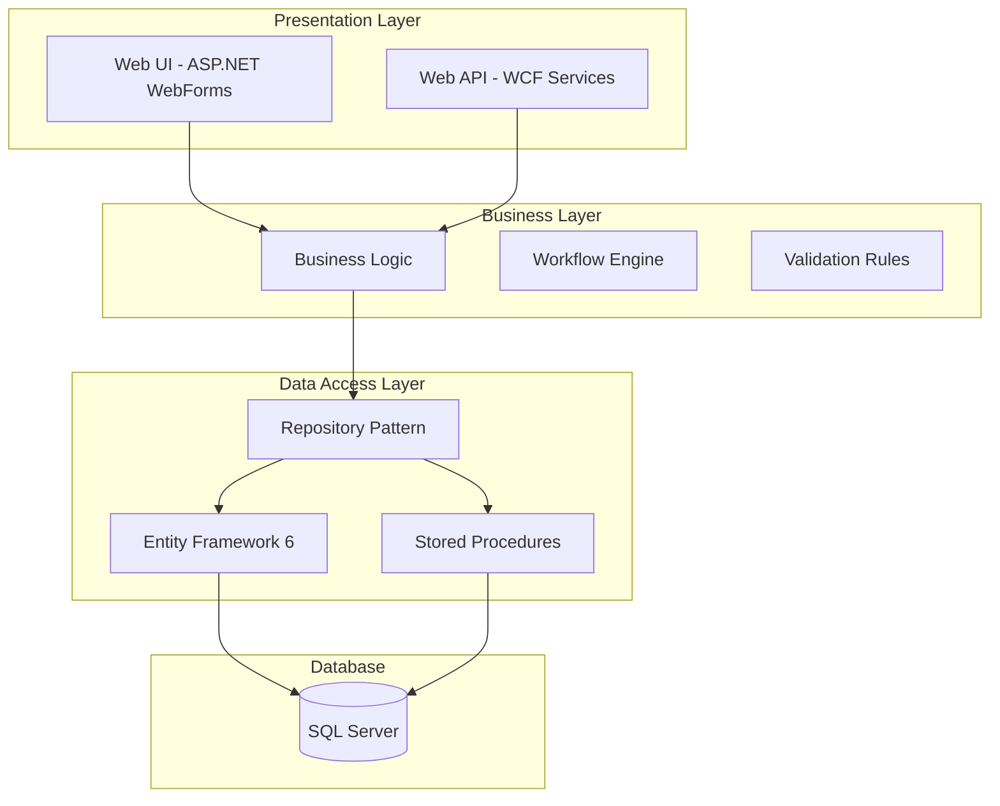

# 🏛️ Legacy System Analysis: $ARGUMENTS


**Analysis Directive**: Conduct comprehensive analysis of the legacy system at "$ARGUMENTS" to extract business logic, map dependencies, document interfaces, and create a modernization blueprint. Focus on understanding the "why" behind the code, not just the "what".

## Quick Context
Analyze legacy .NET systems (Framework 4.7.2 and similar) to extract business logic, system architecture, dependencies, and interfaces for modernization initiatives. This command excels at understanding complex, undocumented systems and producing actionable modernization plans.

## Execution Flow
1. **System Discovery** - Understand project structure and technology stack
2. **Dependency Mapping** - Map all internal and external dependencies
3. **Business Logic Extraction** - Identify and document core business rules
4. **Interface Analysis** - Extract all integration points and contracts
5. **Modernization Planning** - Create migration strategy and recommendations

## Interactive Options
```yaml
analysis-depth: shallow|standard|deep (default: deep)
include-database: true|false (default: true)
include-external-services: true|false (default: true)
generate-migration-code: true|false (default: false)
output-format: markdown|json|html (default: markdown)
```

## Phase 1: System Discovery & Initial Assessment


### Multi-Agent System Analysis

#### Legacy Framework Assessment
Using the Legacy System Analyzer agent to: Analyze the legacy .NET system at '$ARGUMENTS':
1. Identify .NET Framework version and runtime dependencies
2. Map project structure and solution organization
3. Identify key architectural patterns (n-tier, MVC, WebForms, etc.)
4. List all project types (Web, Library, Service, etc.)
5. Identify configuration management approach
6. Map deployment artifacts and hosting requirements
7. Assess overall system complexity and size
Provide comprehensive system overview with technology inventory

#### Initial Security Scan
I'll have the general-purpose agent Legacy security assessment.

### System Inventory Checklist
- [ ] Solution structure mapped
- [ ] Project dependencies graphed
- [ ] Framework versions identified
- [ ] Third-party packages cataloged
- [ ] Database connections found
- [ ] External services identified
- [ ] Configuration sources mapped

## Phase 2: Dependency Analysis


### Dependency Mapping Tasks

#### Internal Dependencies
```
Analyzing internal project references and dependencies:
- Project-to-project references
- Shared libraries and utilities
- Common base classes and interfaces
- Cross-cutting concerns (logging, caching, etc.)
```

#### External Dependencies
Using the Legacy System Analyzer agent to: Map all external dependencies for system at '$ARGUMENTS':
1. Analyze NuGet packages and versions
2. Identify COM/COM+ components
3. Map database dependencies (tables, views, stored procedures)
4. Find web service references (SOAP, REST)
5. Identify file system dependencies
6. Map network share dependencies
7. List third-party service integrations
8. Identify environment-specific dependencies
Create dependency matrix with upgrade paths

### Dependency Risk Matrix
| Dependency Type | Count | Risk Level | Modernization Impact |
|----------------|-------|------------|---------------------|
| .NET Framework | - | - | - |
| NuGet Packages | - | - | - |
| Databases | - | - | - |
| External Services | - | - | - |
| File Systems | - | - | - |

## Phase 3: Business Logic Extraction

<think deeply about the business value and rules embedded in the legacy code>

### Core Business Logic Analysis

#### Domain Model Discovery
I'll have the Legacy System Analyzer agent Business logic extraction.

#### Business Rule Documentation
```markdown
## Extracted Business Rules

### Entity: [Name]
**Purpose**: [Business purpose]
**Key Rules**:
1. [Rule 1 with code reference]
2. [Rule 2 with code reference]

### Process: [Name]
**Workflow**: [Step-by-step process]
**Validations**: [List of validations]
**Side Effects**: [External impacts]
```

### Critical Business Logic Patterns
- [ ] Entity lifecycle management
- [ ] Transaction processing rules
- [ ] Pricing and calculation engines
- [ ] Workflow state machines
- [ ] Business validation rules
- [ ] Reporting aggregations
- [ ] Integration transformations

## Phase 4: Interface & Contract Analysis

<think about all the ways the legacy system communicates with the outside world>

### Interface Discovery Tasks

#### API Surface Analysis
Using the Legacy System Analyzer agent to: Extract all interfaces from legacy system at '$ARGUMENTS':
1. Map public API endpoints (REST, SOAP, WCF)
2. Document method signatures and contracts
3. Extract request/response DTOs
4. Identify authentication requirements
5. Map API versioning approach
6. Document error codes and responses
7. Extract API documentation/comments
8. Identify consumer applications
Provide complete API specification with examples

#### Data Contract Extraction
```yaml
# Example Interface Documentation
Service: CustomerService
  Endpoint: /api/customers
  Methods:
    - GetCustomer(id: int): CustomerDto
    - CreateCustomer(customer: CustomerDto): int
    - UpdateCustomer(id: int, customer: CustomerDto): bool
  
  DataContracts:
    CustomerDto:
      - Id: int
      - Name: string (required, max 100)
      - Email: string (email format)
      - Status: enum (Active, Inactive, Suspended)
```

### Integration Point Matrix
| Integration Type | Count | Protocol | Documentation | Modernization Strategy |
|-----------------|-------|----------|---------------|----------------------|
| REST APIs | - | HTTP/JSON | - | - |
| SOAP Services | - | XML/SOAP | - | - |
| Database Direct | - | SQL | - | - |
| File Transfers | - | FTP/Share | - | - |
| Message Queues | - | MSMQ/etc | - | - |

## Phase 5: Architecture Reconstruction

<think about the implicit architecture and design patterns in the legacy system>

### Architectural Analysis

#### Pattern Recognition
Using the general-purpose agent to: Reconstruct architecture for legacy system at '$ARGUMENTS':
1. Identify architectural patterns (layered, MVC, etc.)
2. Map component boundaries and responsibilities
3. Identify cross-cutting concerns implementation
4. Document data flow patterns
5. Map transaction boundaries
6. Identify caching strategies
7. Document error handling patterns
8. Map security implementation layers
Provide architectural diagrams with pattern analysis

### Reconstructed Architecture


## Phase 6: Code Quality & Technical Debt Assessment

<think about the maintainability and quality issues in the legacy codebase>

### Quality Metrics Analysis

#### Technical Debt Quantification
Using the general-purpose agent to: Assess code quality for legacy system at '$ARGUMENTS':
1. Calculate cyclomatic complexity metrics
2. Identify code duplication patterns
3. Find dead code and unused components
4. Assess test coverage (if any)
5. Identify anti-patterns and code smells
6. Measure coupling and cohesion
7. Assess maintainability index
8. Find security vulnerabilities
Provide technical debt report with remediation priorities

### Technical Debt Summary
| Category | Issues | Severity | Modernization Impact |
|----------|--------|----------|---------------------|
| Code Duplication | - | - | - |
| Complex Methods | - | - | - |
| Missing Tests | - | - | - |
| Security Issues | - | - | - |
| Outdated Patterns | - | - | - |

## Phase 7: Modernization Strategy

<think strategically about the best path forward for modernization>

### Modernization Planning

#### Migration Strategy Development
Using the general-purpose agent to: Develop modernization strategy for legacy system at '$ARGUMENTS':
1. Recommend target architecture (.NET 8+, microservices, etc.)
2. Suggest migration approach (big bang, strangler fig, etc.)
3. Prioritize components for migration
4. Identify reusable business logic
5. Recommend technology replacements
6. Estimate migration effort and timeline
7. Identify migration risks and mitigations
8. Suggest pilot project approach
Provide phased migration plan with success criteria

### Recommended Migration Path
```markdown
## Modernization Roadmap

### Phase 1: Foundation (Months 1-3)
- Set up CI/CD pipeline
- Create automated tests for critical paths
- Establish new solution structure
- Implement authentication/authorization

### Phase 2: Core Migration (Months 4-8)
- Migrate business entities to .NET 8
- Implement new data access layer
- Create API gateway for legacy integration
- Migrate critical business logic

### Phase 3: Feature Parity (Months 9-12)
- Complete remaining feature migration
- Implement modern UI (Angular/React)
- Optimize performance
- Complete legacy system retirement
```

## Phase 8: Deliverables Generation

<think about creating actionable outputs for the modernization team>

#
## Documentation Updates

<think about what documentation needs updating based on the changes made>

### Update Checklist
Based on the changes made, update these files:

1. **CHANGELOG.md** (Confidence: 95%)
   - Add entry under `[Unreleased]` section
   - Use appropriate section: Added/Changed/Fixed/Removed
   - Include technical details and user impact

2. **FEATURES.md** (If capabilities changed)
   - Document new or modified features
   - Update technical implementation details
   - Include usage examples

3. **CLAUDE.md** (If patterns/conventions introduced)
   - Document new code patterns
   - Update architectural decisions
   - Add domain-specific rules

### Quick Update Commands
```bash
# Automated changelog update
/update-changelog "$ARGUMENTS"

# Manual update template
### [Section]
- Description of change
  - Technical implementation details
  - User-facing impact
  - Breaking changes (if any)
```

### Parallel Documentation Check
Check all documentation files simultaneously for existing references:
```bash
Searching for pattern: $ARGUMENTS
Searching for pattern: $ARGUMENTS
Searching for pattern: $ARGUMENTS
```

## Final Deliverables

#### Documentation Package
- [ ] System overview document
- [ ] Dependency analysis report
- [ ] Business logic catalog
- [ ] Interface specifications
- [ ] Architecture diagrams
- [ ] Technical debt report
- [ ] Migration strategy document
- [ ] Risk assessment matrix

#### Code Artifacts
```markdown
## Generated Artifacts

1. **Domain Models** (`/output/domain-models/`)
   - Entity classes with business logic
   - Value objects and enums
   - Domain service interfaces

2. **API Contracts** (`/output/api-contracts/`)
   - OpenAPI specifications
   - DTO definitions
   - Client SDK templates

3. **Migration Scripts** (`/output/migration/`)
   - Database migration scripts
   - Data transformation utilities
   - Configuration mappings

4. **Test Suites** (`/output/tests/`)
   - Business logic test cases
   - Integration test scenarios
   - Performance benchmarks
```

## Success Criteria

### Analysis Completeness
- ✅ All projects in solution analyzed
- ✅ All dependencies mapped and documented
- ✅ Core business logic extracted and cataloged
- ✅ All interfaces documented with examples
- ✅ Architecture fully reconstructed
- ✅ Technical debt quantified and prioritized
- ✅ Modernization strategy defined with timeline
- ✅ Risk assessment completed

### Quality Metrics
- ✅ 100% of public APIs documented
- ✅ All critical business rules captured
- ✅ Security vulnerabilities identified
- ✅ Migration effort estimated (±20%)
- ✅ All integration points mapped

## Error Handling

### Common Challenges & Solutions

| Challenge | Solution | Prevention |
|-----------|----------|------------|
| Missing source code | Decompile assemblies | Request complete source |
| Undocumented logic | Interview stakeholders | Code archaeology techniques |
| Complex dependencies | Incremental analysis | Dependency injection mapping |
| Huge codebase | Prioritize critical paths | Sampling and profiling |

## Final Summary Report

### Executive Summary
**System**: $ARGUMENTS
**Technology Stack**: [Detected stack]
**Size**: [LOC, projects, dependencies]
**Complexity**: [Low|Medium|High|Critical]
**Business Value**: [Core business logic summary]
**Migration Effort**: [Estimated person-months]
**Recommended Approach**: [Strategy summary]

### Key Findings
1. **Strengths**: [What works well]
2. **Weaknesses**: [What needs improvement]
3. **Opportunities**: [Modernization benefits]
4. **Threats**: [Risks if not modernized]

### Next Steps
1. Review findings with stakeholders
2. Validate business logic extraction
3. Prioritize migration components
4. Set up pilot project
5. Begin incremental modernization

---

**Remember**: Legacy systems often contain decades of embedded business knowledge. The goal is not just to rewrite code, but to preserve and enhance business value while modernizing the technology foundation. Every line of legacy code potentially represents a hard-won business lesson.