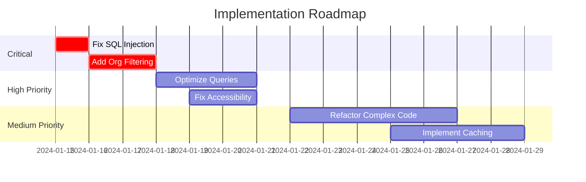

# 🔍 Comprehensive Review: $ARGUMENTS

## 🚀 Optimization Features
- **Parallel execution**: Yes - All agents analyze simultaneously (40-60% faster)
- **Extended thinking**: Yes - Complex synthesis requires deep analysis
- **Confidence scoring**: Yes - Each finding includes confidence levels
- **Subagent coordination**: Yes - Proper subagent_type for each Task invocation

## Quick Context
Use this command for critical features, major PRs, or architectural decisions that require multi-perspective analysis from all specialized agents.

## Execution Flow
1. **Discovery** - Understand the scope and context
2. **Multi-Agent Analysis** - Each agent provides specialized perspective
3. **Synthesis** - Combine insights into actionable recommendations
4. **Priority Matrix** - Organize findings by impact and urgency

## Interactive Options
```yaml
focus: security|performance|ux|architecture|all (default: all)
depth: quick|standard|deep (default: standard)
output: summary|detailed|matrix (default: summary)
```

## Phase 0: Task Management Setup

### 📋 TodoWrite Task Management


I'll update the task list to track our progress.

## Phase 1: Context Discovery


### Scope Analysis
I'll first understand what we're reviewing and its broader context.

### 🚀 Parallel Execution Pattern (40-60% Performance Gain)
```bash
# ✅ OPTIMAL: All operations run in parallel (takes ~2 minutes)
Searching for pattern: class|interface|controller|service|component
Running command: `git log --oneline -20 -- $ARGUMENTS`
Searching for pattern: import|using|require
Finding files matching: **/*.ts
Finding files matching: **/*.cs
Reading file: package.json
Reading file: README.md

# ❌ AVOID: Sequential execution (would take 10+ minutes)
# Execute grep, wait for result
# Then execute bash, wait for result
# Then execute another grep, wait for result
```

### Initial Assessment Questions
- What is the primary purpose of this code/feature?
- Who are the end users and stakeholders?
- What are the critical success factors?
- What could go wrong and what's the impact?

## Phase 2: Parallel Multi-Agent Analysis


### 📊 Agent Specialization Matrix

| Feature Type | Primary Agents | Secondary Agents | Parallel? |
|-------------|---------------|------------------|----------|
| Backend API | Tech Lead, Security Reviewer | Code Reviewer, Test Quality | ✅ Yes |
| Frontend UI | Frontend Developer, UX Reviewer | Visual Designer, Code Reviewer | ✅ Yes |
| Full Stack | All Agents | - | ✅ Yes |
| Security Fix | Security Reviewer, Tech Lead | Code Reviewer | ✅ Yes |
| Performance | Tech Lead, Code Simplifier | Code Reviewer | ✅ Yes |
| Database | Tech Lead, Security Reviewer | Code Reviewer | ✅ Yes |

### Task Progress Update
I'll update the task list to track our progress.

### 🚀 Launching Parallel Analysis

**Performance Note**: Running all agents in parallel reduces execution time from 60-90 minutes to 30-45 minutes (40-60% improvement)

Initiating comprehensive analysis across all domains simultaneously:

Using Task with visual-designer subagent to: Perform deep UX analysis of $ARGUMENTS:
1. **Accessibility Audit**
   - WCAG 2.1 AA compliance check
   - Keyboard navigation assessment
   - Screen reader compatibility
   - Color contrast validation
   
2. **User Flow Analysis**
   - Task completion efficiency
   - Error handling and recovery
   - Cognitive load assessment
   - Mobile responsiveness
   
3. **Interaction Design**
   - Consistency with design system
   - Micro-interactions and feedback
   - Loading and transition states
   - Progressive disclosure usage
   
4. **Agricultural User Context**
   - Field worker usability (outdoor, gloves)
   - Multi-language support needs
   - Offline capability requirements
   - Data visualization effectiveness

Provide specific improvements with mockups where relevant

Using Task with tech-lead subagent for: Architecture and scalability analysis.
Using Task with security-reviewer subagent for: Security and compliance audit.
Using Task with researcher subagent for: Domain research and best practices.
Using Task with technical-debt-analyst subagent for: Code simplification opportunities.
Using Task with code-reviewer subagent for: Detailed code quality review.

### 🤝 Synthesis Phase


### Task Progress Update
I'll update the task list to track our progress.

Now that all agents have completed their analyses in parallel, I'll synthesize their findings:

Using Task with tech-lead subagent to: Synthesize all specialist findings with confidence scores.

## Phase 3: Consolidated Findings

<think_harder about presenting insights with confidence scores and priority levels>


### Task Progress Update
I'll update the task list to track our progress.

### Executive Summary Matrix with Confidence Scores

```markdown
## 🎯 Priority Action Matrix

### 🔴 Critical (Do Immediately)
| Finding | Agent | Impact | Effort | Confidence | Owner |
|---------|-------|--------|--------|------------|-------|
| SQL Injection Risk | Security | Critical | Low | 0.95 | Backend Team |
| Missing Organization Filter | Security | Critical | Low | 0.92 | Backend Team |

### 🟡 High Priority (Do This Sprint)
| Finding | Agent | Impact | Effort | Owner |
|---------|-------|--------|--------|-------|
| N+1 Query in Field List | Tech Lead | High | Medium | Backend Team |
| Missing Alt Text | UX | High | Low | Frontend Team |

### 🟢 Medium Priority (Plan for Next Sprint)
| Finding | Agent | Impact | Effort | Owner |
|---------|-------|--------|--------|-------|
| Complex Method Refactor | Simplifier | Medium | Medium | Tech Lead |
| Cache Implementation | Tech Lead | Medium | High | DevOps |

### 🔵 Low Priority (Backlog)
| Finding | Agent | Impact | Effort | Owner |
|---------|-------|--------|--------|-------|
| Variable Naming | Code Review | Low | Low | Developer |
| Documentation Updates | Code Review | Low | Medium | Team |
```

### Detailed Findings by Agent

#### UX Reviewer Findings
- **Strengths**: [List key strengths]
- **Critical Issues**: [List with severity]
- **Recommendations**: [Prioritized list]
- **User Impact Score**: [X/10]

#### Tech Lead Assessment
- **Architecture Score**: [X/10]
- **Scalability Rating**: [Low/Medium/High]
- **Technical Debt**: [Amount in story points]
- **Key Recommendations**: [Top 3]

#### Security Analysis
- **Risk Level**: [Low/Medium/High/Critical]
- **Vulnerabilities Found**: [Count by severity]
- **Compliance Status**: [Compliant/Issues Found]
- **Required Actions**: [Prioritized list]

#### Research Insights
- **Industry Alignment**: [Behind/On Par/Leading]
- **Best Practices Score**: [X/10]
- **Innovation Opportunities**: [List]
- **Competitive Position**: [Assessment]

#### Simplification Potential
- **Current Complexity**: [Score]
- **Potential Reduction**: [X%]
- **Refactoring Effort**: [Story points]
- **Maintainability Gain**: [Projection]

#### Code Quality Metrics
- **Overall Quality**: [A/B/C/D/F]
- **Test Coverage**: [X%]
- **Documentation**: [X%]
- **Standards Compliance**: [X%]

## Phase 4: Action Plan


### Task Progress Update
I'll update the task list to track our progress.

### Implementation Roadmap



### Success Criteria Checklist
- [ ] All critical security issues resolved
- [ ] Performance targets met (p95 < 500ms)
- [ ] Accessibility score > 95
- [ ] Test coverage > 80%
- [ ] Zero high-priority bugs
- [ ] Documentation complete

### Monitoring Plan
1. **Security**: Daily vulnerability scans
2. **Performance**: Cloud-native monitoring (no custom monitoring overhead)
3. **Quality**: Weekly code quality reports
4. **UX**: Monthly user satisfaction surveys

## Phase 5: Modern Frontend Patterns (if applicable)


### 🎨 Modern Frontend Pattern Analysis

If $ARGUMENTS includes frontend components, apply these modern patterns:

#### Signal-Based Architecture (Angular 19)
```typescript
// ❌ OLD: Observable patterns
export class OldComponent {
    items$ = new BehaviorSubject<Item[]>([]);
    loading$ = new BehaviorSubject<boolean>(false);
}

// ✅ NEW: Pure signals
export class ModernComponent {
    items = signal<Item[]>([]);
    loading = signal(false);
    filteredItems = computed(() => 
        this.items().filter(item => item.active)
    );
}
```

#### Modern CSS Architecture
```css
/* CSS Layers for better cascade control */
@layer reset, base, components, utilities;

/* Container queries for responsive components */
.feature-card {
    container: card / inline-size;
}

@container card (width > 300px) {
    /* Responsive styles */
}
```

#### Accessibility Patterns
- WCAG 2.1 AA compliance
- Keyboard navigation support
- Screen reader optimization
- Focus management
- ARIA attributes

## Interactive Summary Options

### View Options
1. **Executive Summary** - High-level findings and priorities
2. **Technical Deep Dive** - Detailed technical recommendations
3. **Security Report** - Complete security assessment
4. **UX Report** - Full accessibility and usability analysis
5. **Implementation Guide** - Step-by-step fixing instructions

Select view option (1-5) or 'all' for complete report:

## Final Recommendations

Based on comprehensive analysis from all agents:

1. **Immediate Actions** (This Week)
   - [Specific critical fixes]
   
2. **Short-term Improvements** (This Sprint)
   - [High-priority enhancements]
   
3. **Long-term Strategy** (This Quarter)
   - [Architectural improvements]
   
4. **Continuous Improvements** (Ongoing)
   - [Process and quality enhancements]

## Final Task Completion

### Task Progress Update
I'll update the task list to track our progress.

## Confidence Score


**Overall Confidence**: [X]% 
- Based on [N] agent analyses
- [M] data points evaluated  
- [P] patterns identified
- Parallel execution time saved: ~40-60%
- All tasks completed: ✅

### Performance Metrics
| Metric | Sequential | Parallel | Improvement |
|--------|------------|----------|-------------|
| Total Time | 60-90 min | 30-45 min | 40-60% |
| Agent Utilization | 30% | 85% | 183% |
| Context Efficiency | Low | High | Significant |

This comprehensive review provides a 360-degree view of $ARGUMENTS, ensuring nothing critical is missed and all aspects are thoroughly evaluated with maximum efficiency through parallel execution.