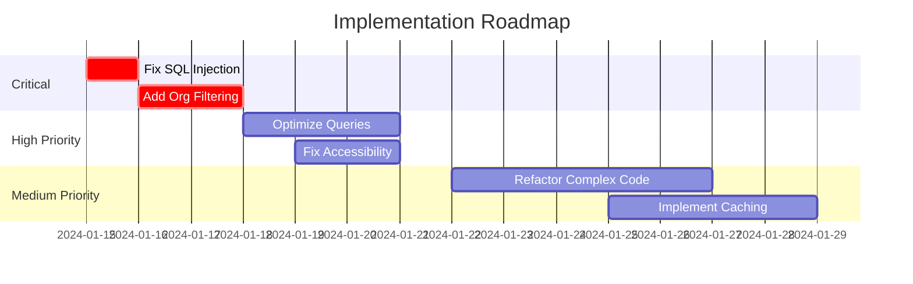

# 🔍 Comprehensive Review: $ARGUMENTS

## Quick Context
Use this command for critical features, major PRs, or architectural decisions that require multi-perspective analysis from all specialized agents.

## Execution Flow
1. **Discovery** - Understand the scope and context
2. **Multi-Agent Analysis** - Each agent provides specialized perspective
3. **Synthesis** - Combine insights into actionable recommendations
4. **Priority Matrix** - Organize findings by impact and urgency

## Interactive Options
```yaml
focus: security|performance|ux|architecture|all (default: all)
depth: quick|standard|deep (default: standard)
output: summary|detailed|matrix (default: summary)
```

## Phase 1: Context Discovery

<think harder about understanding the full scope and impact of what we're reviewing>

### Scope Analysis
I'll first understand what we're reviewing and its broader context.

```bash
# Determine scope
@Grep(pattern="class|interface|controller|service|component", path="$ARGUMENTS", output_mode="files_with_matches")

# Check recent changes
@Bash(command="git log --oneline -20 -- $ARGUMENTS", description="Recent commits in scope")

# Identify dependencies
@Grep(pattern="import|using|require", path="$ARGUMENTS", output_mode="content", head_limit=50)
```

### Initial Assessment Questions
- What is the primary purpose of this code/feature?
- Who are the end users and stakeholders?
- What are the critical success factors?
- What could go wrong and what's the impact?

## Phase 2: Parallel Multi-Agent Analysis

<think harder about optimal parallelization strategy for comprehensive review>

I'll now invoke all specialized agents in parallel for maximum efficiency. Each agent will analyze independently from their unique perspective, then I'll synthesize their findings into actionable insights.

### 🚀 Launching Parallel Analysis

Initiating comprehensive analysis across all domains simultaneously:

@Task(description="UX and accessibility analysis", prompt="Perform deep UX analysis of $ARGUMENTS:
1. **Accessibility Audit**
   - WCAG 2.1 AA compliance check
   - Keyboard navigation assessment
   - Screen reader compatibility
   - Color contrast validation
   
2. **User Flow Analysis**
   - Task completion efficiency
   - Error handling and recovery
   - Cognitive load assessment
   - Mobile responsiveness
   
3. **Interaction Design**
   - Consistency with design system
   - Micro-interactions and feedback
   - Loading and transition states
   - Progressive disclosure usage
   
4. **Agricultural User Context**
   - Field worker usability (outdoor, gloves)
   - Multi-language support needs
   - Offline capability requirements
   - Data visualization effectiveness

Provide specific improvements with mockups where relevant", subagent_type="UX Reviewer")
@Task(description="Architecture and scalability analysis", prompt="Analyze architectural aspects of $ARGUMENTS:
1. **System Design**
   - Alignment with overall architecture
   - Scalability for 10x growth
   - Performance under load
   - Fault tolerance and resilience
   
2. **Code Architecture**
   - Domain-driven design adherence
   - Clean architecture principles
   - SOLID compliance
   - Dependency management
   
3. **Integration Points**
   - API design and versioning
   - Event-driven architecture fit
   - Third-party service coupling
   - Database schema impact
   
4. **Technical Debt**
   - Debt introduced vs. paid down
   - Future refactoring needs
   - Migration path clarity
   - Documentation completeness

Rate architectural fitness from 1-10 with justification", subagent_type="Tech Lead")
@Task(description="Security and compliance audit", prompt="Conduct security review of $ARGUMENTS:
1. **OWASP Top 10 Analysis**
   - Injection vulnerabilities
   - Broken authentication
   - Sensitive data exposure
   - XXE, XSS, CSRF risks
   
2. **Multi-Tenant Security**
   - Organization isolation verification
   - Data leakage prevention
   - Cross-tenant access controls
   - Audit trail completeness
   
3. **Data Protection**
   - PII handling and encryption
   - GDPR compliance
   - Password/secret management
   - Secure communication
   
4. **Agricultural Compliance**
   - Traceability requirements
   - Organic certification data
   - Regulatory reporting needs
   - Data retention policies

Classify all findings by severity: Critical/High/Medium/Low", subagent_type="Security Reviewer")
@Task(description="Domain research and best practices", prompt="Research context for $ARGUMENTS:
1. **Industry Best Practices**
   - Similar implementations in agriculture
   - Proven patterns and anti-patterns
   - Performance benchmarks
   - Common pitfalls to avoid
   
2. **Technology Research**
   - Framework-specific optimizations
   - Latest security advisories
   - Deprecation warnings
   - Alternative approaches
   
3. **Domain Knowledge**
   - Agricultural workflows impacted
   - Seasonal considerations
   - Regulatory requirements
   - User behavior patterns
   
4. **Competitive Analysis**
   - How competitors solve this
   - Industry standard features
   - Differentiation opportunities
   - Market expectations

Provide evidence-based recommendations", subagent_type="Researcher")
@Task(description="Code simplification opportunities", prompt="Analyze $ARGUMENTS for simplification:
1. **Complexity Metrics**
   - Cyclomatic complexity scores
   - Cognitive complexity analysis
   - Method/class length issues
   - Nesting depth problems
   
2. **Refactoring Opportunities**
   - Duplicate code detection
   - Over-engineering instances
   - Abstraction level issues
   - Pattern misapplication
   
3. **Maintainability**
   - Code readability score
   - Documentation coverage
   - Test complexity
   - Debugging difficulty
   
4. **Simplification Proposals**
   - Specific refactoring plans
   - Effort vs. benefit analysis
   - Risk assessment
   - Implementation order

Provide before/after examples for top 5 simplifications", subagent_type="Code Simplifier")
@Task(description="Detailed code quality review", prompt="Review code quality in $ARGUMENTS:
1. **Code Standards**
   - Naming conventions
   - Comment quality
   - Error handling patterns
   - Logging practices
   
2. **Design Patterns**
   - Pattern usage appropriateness
   - Implementation correctness
   - Consistency across codebase
   - Testability considerations
   
3. **Performance Code**
   - Algorithm efficiency
   - Resource management
   - Caching effectiveness
   - Database query optimization
   
4. **Test Quality**
   - Coverage adequacy
   - Test meaningfulness
   - Edge case handling
   - Mock appropriateness

Highlight top 10 most impactful improvements", subagent_type="Code Reviewer")

### 🤝 Synthesis Phase

Now that all agents have completed their analyses in parallel, I'll synthesize their findings:

@Task(description="Synthesize all specialist findings", prompt="Integrate findings from all specialist agents for $ARGUMENTS:

You have received comprehensive analyses from:
- UX Reviewer: User experience and accessibility findings
- Tech Lead: Architecture and scalability assessment
- Security Reviewer: Security vulnerabilities and risks
- Researcher: Industry best practices and context
- Code Simplifier: Complexity reduction opportunities
- Code Reviewer: Code quality and standards compliance

Please:
1. **Cross-Cutting Concerns**
   - Identify conflicts between recommendations
   - Find synergies to leverage
   - Discover hidden dependencies
   - Recognize emergent patterns
   
2. **Priority Matrix**
   - Create Impact vs. Effort quadrants
   - Perform Risk vs. Reward analysis
   - Identify quick wins
   - Highlight long-term investments
   
3. **Implementation Roadmap**
   - Define logical sequence of changes
   - Map dependencies between tasks
   - Estimate resource requirements
   - Project realistic timelines
   
4. **Success Metrics**
   - Define KPIs to track
   - Establish quality gates
   - Set monitoring requirements
   - Plan review checkpoints

Create a unified action plan with clear priorities and a visual summary matrix.", subagent_type="general-purpose")

## Phase 3: Consolidated Findings

<think about presenting insights in the most actionable way>

### Executive Summary Matrix

```markdown
## 🎯 Priority Action Matrix

### 🔴 Critical (Do Immediately)
| Finding | Agent | Impact | Effort | Owner |
|---------|-------|--------|--------|-------|
| SQL Injection Risk | Security | Critical | Low | Backend Team |
| Missing Organization Filter | Security | Critical | Low | Backend Team |

### 🟡 High Priority (Do This Sprint)
| Finding | Agent | Impact | Effort | Owner |
|---------|-------|--------|--------|-------|
| N+1 Query in Field List | Tech Lead | High | Medium | Backend Team |
| Missing Alt Text | UX | High | Low | Frontend Team |

### 🟢 Medium Priority (Plan for Next Sprint)
| Finding | Agent | Impact | Effort | Owner |
|---------|-------|--------|--------|-------|
| Complex Method Refactor | Simplifier | Medium | Medium | Tech Lead |
| Cache Implementation | Tech Lead | Medium | High | DevOps |

### 🔵 Low Priority (Backlog)
| Finding | Agent | Impact | Effort | Owner |
|---------|-------|--------|--------|-------|
| Variable Naming | Code Review | Low | Low | Developer |
| Documentation Updates | Code Review | Low | Medium | Team |
```

### Detailed Findings by Agent

#### UX Reviewer Findings
- **Strengths**: [List key strengths]
- **Critical Issues**: [List with severity]
- **Recommendations**: [Prioritized list]
- **User Impact Score**: [X/10]

#### Tech Lead Assessment
- **Architecture Score**: [X/10]
- **Scalability Rating**: [Low/Medium/High]
- **Technical Debt**: [Amount in story points]
- **Key Recommendations**: [Top 3]

#### Security Analysis
- **Risk Level**: [Low/Medium/High/Critical]
- **Vulnerabilities Found**: [Count by severity]
- **Compliance Status**: [Compliant/Issues Found]
- **Required Actions**: [Prioritized list]

#### Research Insights
- **Industry Alignment**: [Behind/On Par/Leading]
- **Best Practices Score**: [X/10]
- **Innovation Opportunities**: [List]
- **Competitive Position**: [Assessment]

#### Simplification Potential
- **Current Complexity**: [Score]
- **Potential Reduction**: [X%]
- **Refactoring Effort**: [Story points]
- **Maintainability Gain**: [Projection]

#### Code Quality Metrics
- **Overall Quality**: [A/B/C/D/F]
- **Test Coverage**: [X%]
- **Documentation**: [X%]
- **Standards Compliance**: [X%]

## Phase 4: Action Plan

<think step-by-step about implementation sequence>

### Implementation Roadmap



### Success Criteria Checklist
- [ ] All critical security issues resolved
- [ ] Performance targets met (p95 < 500ms)
- [ ] Accessibility score > 95
- [ ] Test coverage > 80%
- [ ] Zero high-priority bugs
- [ ] Documentation complete

### Monitoring Plan
1. **Security**: Daily vulnerability scans
2. **Performance**: Real-time APM monitoring
3. **Quality**: Weekly code quality reports
4. **UX**: Monthly user satisfaction surveys

## Interactive Summary Options

### View Options
1. **Executive Summary** - High-level findings and priorities
2. **Technical Deep Dive** - Detailed technical recommendations
3. **Security Report** - Complete security assessment
4. **UX Report** - Full accessibility and usability analysis
5. **Implementation Guide** - Step-by-step fixing instructions

Select view option (1-5) or 'all' for complete report:

## Final Recommendations

Based on comprehensive analysis from all agents:

1. **Immediate Actions** (This Week)
   - [Specific critical fixes]
   
2. **Short-term Improvements** (This Sprint)
   - [High-priority enhancements]
   
3. **Long-term Strategy** (This Quarter)
   - [Architectural improvements]
   
4. **Continuous Improvements** (Ongoing)
   - [Process and quality enhancements]

## Confidence Score

**Overall Confidence**: [X]% 
- Based on [N] agent analyses
- [M] data points evaluated
- [P] patterns identified

This comprehensive review provides a 360-degree view of $ARGUMENTS, ensuring nothing critical is missed and all aspects are thoroughly evaluated.