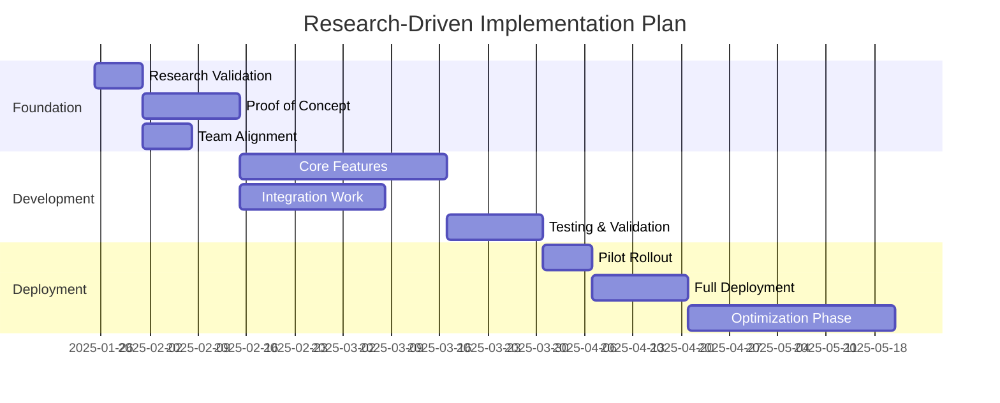

# 🧠 Deep Research Analysis: $ARGUMENTS

## OPUS 4 ACTIVATION - EXTENDED THINKING MODE
<think harder about the research topic from multiple perspectives - technical, business, operational, and strategic implications>

**Research Directive**: Conduct comprehensive analysis of "$ARGUMENTS" using deep interleaved thinking to uncover insights, patterns, and actionable recommendations. Leverage Opus 4's advanced reasoning capabilities to explore complex interconnections and provide strategic guidance.

## Phase 1: Research Scope Definition (Deep Reasoning)

<think step-by-step about the research dimensions and boundaries>

### Initial Analysis Framework
Execute parallel research streams:
1. **Domain Context**: Understanding the problem space
2. **Current State Analysis**: What exists today - patterns, solutions, limitations
3. **Industry Best Practices**: How leading organizations solve similar challenges
4. **Future Trends**: Emerging technologies and methodologies
5. **Risk & Opportunity Assessment**: What to leverage vs. what to avoid

### Research Questions to Address
<think deeper about the fundamental questions that need answering>
- What are the core challenges and constraints?
- Who are the stakeholders and what are their needs?
- What are the technical and business trade-offs?
- What are the short-term vs. long-term implications?
- How does this align with the domain context?

## Phase 2: Information Gathering (Parallel Analysis)

### Codebase Analysis
```
Parallel searches to understand existing patterns:
- Domain models and business logic
- Service implementations
- Infrastructure patterns
- Configuration and setup
```

### External Research
<think about credible sources and latest developments>
- Industry standards and specifications
- Academic research and whitepapers
- Open source implementations
- Vendor documentation and case studies
- Community best practices and discussions

### Pattern Recognition
<use extended thinking to identify patterns across the research>
- Common approaches and their trade-offs
- Anti-patterns to avoid
- Success factors from similar implementations
- Failure modes and mitigation strategies

## Phase 3: Deep Analysis (Opus 4 Extended Reasoning)

### Multi-Dimensional Analysis Framework

#### Technical Dimension
<think harder about technical implications and architectural decisions>
- **Performance Impact**: Latency, throughput, resource utilization
- **Scalability Patterns**: Horizontal vs. vertical, sharding strategies
- **Security Considerations**: Authentication, authorization, data protection
- **Integration Complexity**: APIs, data formats, protocols
- **Maintenance Burden**: Code complexity, operational overhead

#### Business Dimension
<analyze business value and strategic alignment>
- **ROI Analysis**: Implementation cost vs. business value
- **Time to Market**: Development timeline and milestones
- **Competitive Advantage**: Differentiation opportunities
- **Risk Assessment**: Technical, operational, and market risks
- **Compliance Requirements**: Regulatory and industry standards

#### Operational Dimension
<consider day-to-day operational impacts>
- **Team Capabilities**: Required skills and training
- **Deployment Strategy**: Rollout plan and rollback procedures
- **Monitoring & Observability**: Metrics, alerts, dashboards
- **Support Requirements**: Documentation, runbooks, escalation
- **Disaster Recovery**: Backup, restore, business continuity

## Phase 4: Synthesis & Recommendations

### Key Findings Summary
<synthesize research into actionable insights>

#### Critical Insights
1. **Primary Discovery**: [Core finding from research]
2. **Unexpected Learning**: [Surprising insight that changes perspective]
3. **Risk Identification**: [Major risk that must be addressed]
4. **Opportunity Recognition**: [Untapped potential discovered]

### Strategic Recommendations

#### Immediate Actions (0-1 month)
- **Quick Wins**: Low-effort, high-impact changes
- **Risk Mitigation**: Address critical vulnerabilities
- **Foundation Building**: Prerequisites for larger changes

#### Short-term Initiatives (1-3 months)
- **Core Implementation**: Primary solution components
- **Team Enablement**: Training and process updates
- **Measurement Setup**: KPIs and success metrics

#### Long-term Vision (3-12 months)
- **Strategic Evolution**: Major architectural shifts
- **Capability Development**: Team and technology growth
- **Market Positioning**: Competitive advantages to build

### Implementation Roadmap



## Phase 5: Risk Analysis & Mitigation (Deep Thinking)

<think harder about what could go wrong and how to prevent it>

### Risk Matrix

| Risk Category | Probability | Impact | Mitigation Strategy |
|--------------|-------------|---------|-------------------|
| Technical Debt | Medium | High | Incremental refactoring, clear boundaries |
| Performance Degradation | Low | High | Load testing, monitoring, gradual rollout |
| Team Resistance | Medium | Medium | Early involvement, training, clear benefits |
| Integration Failures | Low | Medium | Comprehensive testing, fallback mechanisms |
| Budget Overrun | Medium | Medium | Phased approach, regular checkpoints |

### Contingency Planning
1. **Fallback Options**: Alternative approaches if primary fails
2. **Rollback Procedures**: How to safely revert changes
3. **Communication Plan**: Stakeholder updates and escalation
4. **Success Criteria**: Clear go/no-go decision points

## Phase 6: Detailed Technical Specification

<provide concrete technical guidance based on research>

### Architecture Decision Record (ADR)

```markdown
## ADR-[NUMBER]: [DECISION TITLE]

### Status
Proposed

### Context
[Detailed background from research findings]

### Decision
[Specific technical choice with rationale]

### Consequences
**Positive:**
- [Benefit 1 with supporting evidence]
- [Benefit 2 with metrics]

**Negative:**
- [Trade-off 1 with mitigation]
- [Trade-off 2 with acceptance criteria]

### Alternatives Considered
1. [Alternative 1]: [Why not chosen]
2. [Alternative 2]: [Why not chosen]
```

### Sample Implementation

```csharp
// Example implementation based on research findings
public class ResearchDrivenSolution : IOptimalApproach
{
    // Implementation incorporates all research insights
    // Comments reference specific findings and rationale
}
```

## Phase 7: Monitoring & Success Metrics

### Key Performance Indicators (KPIs)
<define measurable success criteria>

#### Technical Metrics
- Response time: < [target]ms (p95)
- Error rate: < [target]%
- Resource utilization: < [target]%
- Code coverage: > [target]%

#### Business Metrics
- User adoption: [target]% in [timeframe]
- Process efficiency: [target]% improvement
- Cost savings: $[target] annually
- Customer satisfaction: [target] NPS increase

### Monitoring Dashboard
```yaml
dashboard:
  - metric: API Performance
    threshold: 200ms
    alert: PagerDuty
  - metric: Error Rate
    threshold: 0.1%
    alert: Slack
  - metric: User Engagement
    threshold: 80%
    alert: Email
```

## Phase 8: Knowledge Transfer & Documentation

### Documentation Deliverables
1. **Executive Summary**: 1-page overview for leadership
2. **Technical Deep Dive**: Detailed implementation guide
3. **Operations Runbook**: Day-to-day management procedures
4. **Training Materials**: Team enablement resources

### Knowledge Base Update
- Update project documentation with patterns discovered
- Document significant decisions as ADRs
- Create runbooks for operations
- Share learnings with team

## OPUS 4 FINAL SYNTHESIS

<use maximum thinking depth to integrate all insights>

### Executive Summary
**Research Topic**: $ARGUMENTS

**Key Finding**: [Primary insight that drives all recommendations]

**Recommended Approach**: [Clear, actionable direction based on research]

**Expected Outcome**: [Measurable business and technical impact]

### Top 3 Recommendations
1. **[HIGHEST PRIORITY]**: [Specific action with timeline]
2. **[MEDIUM PRIORITY]**: [Specific action with dependencies]  
3. **[FUTURE CONSIDERATION]**: [Strategic direction to explore]

### Critical Success Factors
- ✅ [Factor 1]: [How to ensure]
- ✅ [Factor 2]: [How to ensure]
- ✅ [Factor 3]: [How to ensure]

### Next Steps Checklist
- [ ] Review findings with stakeholders
- [ ] Validate assumptions with POC
- [ ] Create detailed project plan
- [ ] Assign team responsibilities
- [ ] Set up monitoring and metrics
- [ ] Schedule regular review checkpoints

---

**Remember**: Deep research with Opus 4 combines exhaustive analysis with practical recommendations. Every finding is backed by evidence, every recommendation considers implementation reality, and every decision accounts for long-term sustainability.