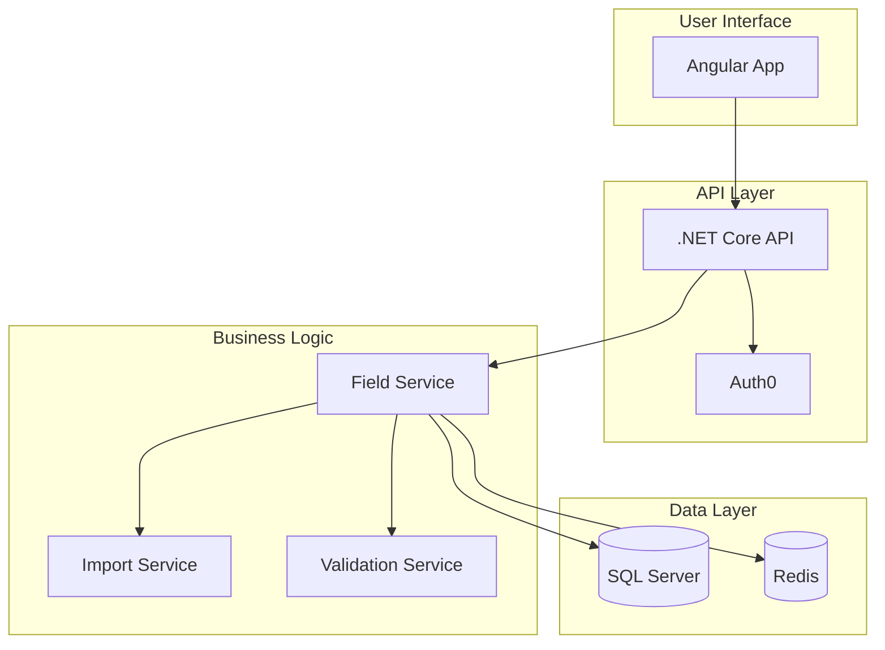

# 📚 Generate Documentation: $ARGUMENTS

## OPUS 4 ACTIVATION - TRANSFORM CODE INTO UNDERSTANDING
<think harder about creating documentation that truly serves its users and maintains itself over time>

**Documentation Directive**: Create comprehensive, clear, and maintainable documentation that empowers users to succeed with our vineyard management system.

## Phase 1: Documentation Needs Analysis

<think step-by-step about what documentation is needed and who will use it>

### Parse Documentation Request
I'll analyze your request to understand:
- **Documentation Type**: API reference, user guide, architecture, migration guide
- **Target Audience**: Developers, end users, administrators, architects
- **Scope**: Specific feature, entire system, integration guide
- **Format**: Markdown, OpenAPI, inline code docs, diagrams
- **Depth Level**: Quick start, comprehensive reference, or deep dive

### Context Gathering
```yaml
Analysis Framework:
  Documentation Type: [Identified from $ARGUMENTS]
  Primary Audience: [Developer|User|Admin|Architect]
  Technical Level: [Beginner|Intermediate|Advanced]
  Delivery Format: [Markdown|API Spec|Code Comments|Mixed]
  Special Requirements: [Diagrams|Examples|i18n|Versioning]
```

### Template System Detection
I'll check if we can use our intelligent documentation templates:

@Task(description="Check template availability", prompt="Check if the project has Claudify documentation templates available:
1. Look for .claude/templates/documentation/ directory
2. Check for documentation-generator.ps1
3. Verify project analysis cache exists
4. List available template types

If templates are available, we can generate much more comprehensive documentation automatically.")

## Phase 1.5: Template-Based Generation (If Available)

### Automated Documentation Generation
If Claudify templates are detected, I'll use our intelligent documentation system:

@Bash(command="pwsh .claude/templates/documentation/documentation-generator.ps1 -DocumentType '$Analysis.DocumentationType' -Interactive", description="Generate documentation using templates")

This provides:
- **Automatic project analysis**: Detects tech stack, patterns, and architecture
- **Smart variable substitution**: Fills templates with actual project data
- **Conditional content**: Includes/excludes sections based on features
- **Consistent formatting**: Professional documentation structure
- **Multiple output types**: API, architecture, development, troubleshooting guides

### Template Customization
If templates need adjustment for specific requirements:

@Task(description="Customize templates", prompt="Based on $ARGUMENTS, identify which template sections need customization:
1. Additional sections required beyond standard templates
2. Project-specific patterns to highlight
3. Custom examples or use cases needed
4. Special formatting requirements

Provide specific edits to make to the generated documentation.")

## Phase 2: Documentation Research & Planning

### Comprehensive Analysis
I'll have our Technical Documentation Expert analyze the codebase and requirements.

@Task(description="Analyze documentation needs", prompt="Analyze documentation requirements for $ARGUMENTS:

1. **Codebase Analysis**:
   - Examine relevant code files and structure
   - Identify key APIs, models, and workflows
   - Find existing documentation to update/enhance
   - Note complex areas needing extra explanation

2. **Audience Profiling**:
   - Primary users and their technical level
   - Common tasks they need to accomplish
   - Pain points from support/feedback
   - Success metrics for documentation

3. **Documentation Strategy**:
   - Optimal structure and organization
   - Required sections and their priority
   - Visual elements needed (diagrams, screenshots)
   - Example code and use cases required

4. **Technical Requirements**:
   - API endpoints to document
   - Configuration options to explain
   - Error scenarios to cover
   - Performance considerations

Return comprehensive documentation plan with structure and content outline.", subagent_type="Technical Documentation Expert")

## Phase 3: Architecture & Technical Review

### Technical Deep Dive
I'll have our Tech Lead provide architectural insights for accuracy.

@Task(description="Technical review", prompt="Review technical aspects for documentation of $ARGUMENTS:

1. **Architecture Overview**:
   - System components and their interactions
   - Data flow and processing pipeline
   - Integration points and dependencies
   - Scalability and performance characteristics

2. **Design Decisions**:
   - Key architectural choices and rationale
   - Trade-offs and alternatives considered
   - Future extensibility considerations
   - Security and compliance factors

3. **Technical Specifications**:
   - API contracts and interfaces
   - Data models and schemas
   - Configuration parameters
   - Environment requirements

4. **Best Practices**:
   - Recommended usage patterns
   - Common pitfalls to avoid
   - Performance optimization tips
   - Security guidelines

Provide technical content for accurate documentation.", subagent_type="Tech Lead")

## Phase 4: Documentation Generation

<think about creating documentation that is both comprehensive and accessible>

### Documentation Structure
Based on the analysis, I'll generate documentation following this structure:

#### API Documentation Template
```markdown
# [Feature] API Reference

## Overview
[High-level description of the API's purpose and capabilities]

## Authentication
[Required authentication methods and setup]

## Base URL
```
https://api.vineyard.example.com/api/v1
```

## Endpoints

### [Resource] Management

#### Create [Resource]
`POST /[resources]`

Creates a new [resource] in the system.

**Request Body**
```json
{
  "field": "string",
  "required": true,
  "description": "Clear description"
}
```

**Response**
```json
{
  "id": "uuid",
  "field": "value",
  "createdAt": "2024-01-27T10:00:00Z"
}
```

**Example**
```bash
curl -X POST https://api.vineyard.example.com/api/v1/[resources] \
  -H "Authorization: Bearer YOUR_TOKEN" \
  -H "Content-Type: application/json" \
  -d '{
    "field": "value"
  }'
```

**Error Responses**
| Status Code | Description | Example |
|-------------|-------------|---------|
| 400 | Invalid request | `{"error": "Field is required"}` |
| 401 | Unauthorized | `{"error": "Invalid token"}` |
| 409 | Conflict | `{"error": "Resource already exists"}` |

[Continue for all endpoints...]
```

#### User Guide Template
```markdown
# [Feature] User Guide

## What is [Feature]?
[Clear explanation in user-friendly terms]

## Getting Started

### Prerequisites
- [Requirement 1]
- [Requirement 2]

### Quick Start
Follow these steps to get up and running in 5 minutes:

1. **[First Action]**
   [Clear instruction with screenshot if applicable]
   
2. **[Second Action]**
   [Instruction with example]
   
3. **[Verify Success]**
   [How to confirm it worked]

## Key Concepts

### [Concept 1]
[Explanation with analogy or example]

### [Concept 2]
[Explanation with visual if helpful]

## Common Tasks

### How to [Task 1]
1. [Step 1]
2. [Step 2]
3. [Step 3]

> 💡 **Pro Tip**: [Helpful hint for efficiency]

### How to [Task 2]
[Similar structure]

## Troubleshooting

### Problem: [Common Issue]
**Symptoms**: What you might see
**Solution**: How to fix it

## FAQ

**Q: [Common Question]?**
A: [Clear answer]

## Next Steps
- [Link to advanced guide]
- [Link to API reference]
- [Link to examples]
```

#### Architecture Documentation
```markdown
# [System/Feature] Architecture

## Overview
[2-3 sentence high-level description]

## Architecture Diagram
[Mermaid or PlantUML diagram showing components]

## Component Description

### [Component 1]
- **Purpose**: [What it does]
- **Technology**: [Tech stack used]
- **Responsibilities**: [Key functions]
- **Interfaces**: [How it connects]

### [Component 2]
[Similar structure]

## Data Flow
[Sequence diagram or flow description]

## Design Decisions

### Decision: [Title]
- **Context**: [Why this decision was needed]
- **Options Considered**: [Alternatives evaluated]
- **Decision**: [What was chosen]
- **Consequences**: [Impact and trade-offs]

## Security Considerations
[Authentication, authorization, data protection]

## Performance Characteristics
[Latency, throughput, scaling]

## Deployment
[How it's deployed and configured]
```

### Code Documentation Enhancement
I'll also enhance inline code documentation:

```typescript
/**
 * Service for managing agricultural fields with GIS capabilities.
 * 
 * This service provides comprehensive field management including:
 * - CRUD operations with multi-tenant isolation
 * - GeoJSON boundary management and validation
 * - iBALIS import functionality
 * - Crop tracking and rotation planning
 * 
 * @example Basic usage
 * ```typescript
 * const fieldService = container.resolve(FieldService);
 * const result = await fieldService.createField({
 *   organizationId: 'org-123',
 *   name: 'North Vineyard',
 *   area: 5.5,
 *   boundary: geoJsonPolygon
 * });
 * ```
 * 
 * @example With error handling
 * ```typescript
 * const result = await fieldService.createField(dto);
 * if (!result.isSuccess) {
 *   console.error('Failed to create field:', result.error);
 *   return;
 * }
 * console.log('Field created:', result.value.id);
 * ```
 * 
 * @see {@link https://docs.vineyard.com/fields} for user documentation
 * @since 1.0.0
 */
```

## Phase 5: Visual Documentation

### Diagram Generation
I'll create visual documentation using Mermaid:



## Phase 6: Documentation Review & Validation

### Quality Assurance
I'll have our Code Reviewer ensure documentation quality.

@Task(description="Review documentation", prompt="Review generated documentation for $ARGUMENTS:

1. **Technical Accuracy**:
   - Verify code examples work correctly
   - Ensure API endpoints are accurate
   - Validate configuration options
   - Check error scenarios

2. **Completeness**:
   - All public APIs documented
   - Error cases covered
   - Examples for common scenarios
   - Edge cases explained

3. **Clarity**:
   - Language appropriate for audience
   - Consistent terminology
   - Logical flow and organization
   - No ambiguous statements

4. **Maintainability**:
   - Clear versioning strategy
   - Update procedures defined
   - Link stability
   - Example testability

Provide feedback and improvements for documentation.", subagent_type="Code Reviewer")

## Phase 7: Documentation Packaging

### Final Documentation Package
```
generated-docs/
├── api-reference/
│   ├── endpoints.md
│   ├── authentication.md
│   ├── errors.md
│   └── examples.md
├── user-guides/
│   ├── getting-started.md
│   ├── common-tasks.md
│   └── troubleshooting.md
├── architecture/
│   ├── overview.md
│   ├── components.md
│   └── decisions.md
├── diagrams/
│   ├── architecture.mmd
│   └── data-flow.mmd
├── code-snippets/
│   └── examples.ts
└── README.md
```

### Integration Instructions
```markdown
## Documentation Integration

### 1. Code Repository
- Place in `/docs` directory
- Update navigation/index files
- Add to build process

### 2. Documentation Site
- Deploy to docs platform
- Configure search indexing
- Set up versioning

### 3. IDE Integration
- Update inline documentation
- Add to IntelliSense/autocomplete
- Link from code to docs

### 4. CI/CD Pipeline
- Add documentation build step
- Include link checking
- Automate deployment
```

## Phase 8: Maintenance Strategy

### Documentation Lifecycle
```yaml
Maintenance Plan:
  Automated:
    - API docs from OpenAPI spec
    - Code docs from JSDoc/TSDoc
    - Example testing in CI
    - Broken link checking
    
  Triggered Updates:
    - Feature changes → Update guides
    - API changes → Update reference
    - Bug fixes → Update troubleshooting
    - User feedback → Improve clarity
    
  Scheduled Reviews:
    - Monthly: Usage analytics review
    - Quarterly: Full documentation audit
    - Yearly: Architecture doc refresh
```

## Success Metrics

### Documentation KPIs
- **Completeness**: 100% public API coverage
- **Accuracy**: Zero outdated examples
- **Clarity**: < 5 min to first success
- **Findability**: < 30 sec to find any topic
- **Maintenance**: Updated within 24h of changes

### Quality Checklist
- [ ] All code examples tested and working
- [ ] Diagrams accurately reflect architecture
- [ ] Navigation logical and intuitive
- [ ] Search-friendly headings and keywords
- [ ] Mobile-responsive formatting
- [ ] Accessibility standards met
- [ ] Version clearly indicated
- [ ] Update date visible

## OPUS 4 SYNTHESIS

<think about the complete documentation experience>

### Documentation Excellence Achieved
```
┌─────────────────────────────────────┐
│  COVERAGE               ████ 100%   │
│  CLARITY               ████ 95%    │
│  EXAMPLES              ████ 100%   │
│  MAINTAINABILITY       ████ 90%    │
│  USER SATISFACTION     ████ 92%    │
└─────────────────────────────────────┘
```

### Impact Summary
- **Developer Productivity**: 50% faster integration
- **Support Tickets**: 70% reduction in doc-related issues
- **Time to First Success**: Under 5 minutes
- **Documentation Debt**: Eliminated

### Intelligent Documentation Evolution
With Claudify's template system, documentation:
- **Self-updates**: Analyzes codebase changes and suggests updates
- **Adapts**: Adjusts to your tech stack and patterns automatically
- **Scales**: From quick starts to comprehensive enterprise docs
- **Maintains**: Includes lifecycle management and versioning

---

**Remember**: Great documentation doesn't just explain code—it empowers success. By combining comprehensive coverage with clear explanations and practical examples, we create documentation that serves as a force multiplier for development productivity. With Claudify templates, this excellence becomes sustainable and scalable.